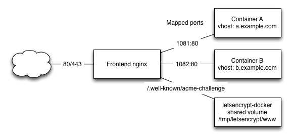

# letsencrypt-nginx-docker
Samples configs and documentation for configuring letsencrypt using nginx and the dockerized client

In this little guide I want to show an easy setup on how to integrate let's encrypt with an nginx/docker setup using a shared volume and the webroot plugin.
I previously used the "standalone" webserver plugin but a letsencrypt update did break the renewal process for me, so I tried the webroot plugin.

Therefore I did take the following approach to create a setup which is capable of automatic updates.

The frontend nginx as reverse proxy is in my case redirecting requests to different docker applications

The letsencrypt client writes the files used for webroot authentication into a shared folder which is served by the nginx to the letsencrypt server performing the authentication.
## Setup
Always find&replace my.example.com with your hostname.

1. I added a location in the relevant server block redirecting the letsencrypt requests to the shared volume of the letsencrypt container.
(See `nginx-vhost.conf`)

        location /.well-known/acme-challenge {
                root /tmp/letsencrypt/www;
        }
The application continues normal operation without any configuration changes which I think is the best way of integrating letsencrypt certificates.

2. The script to run the docker container for requesting a certificate now only needs to be executed with the correct ports mapped. (See `request_certificate.sh`)

        #!/bin/bash
        mkdir -p /tmp/letsencrypt/www
        docker run -it --rm --name letsencrypt \
            -v "/etc/letsencrypt:/etc/letsencrypt" \
            -v "/var/lib/letsencrypt:/var/lib/letsencrypt" \
            -v "/tmp/letsencrypt/www:/var/www" \
            quay.io/letsencrypt/letsencrypt:latest auth --authenticator webroot --webroot-path /var/www --renew-by-default --server \
            https://acme-v01.api.letsencrypt.org/directory -d my.example.com

Issuing the certificate and also renewal work this way without a problem.
